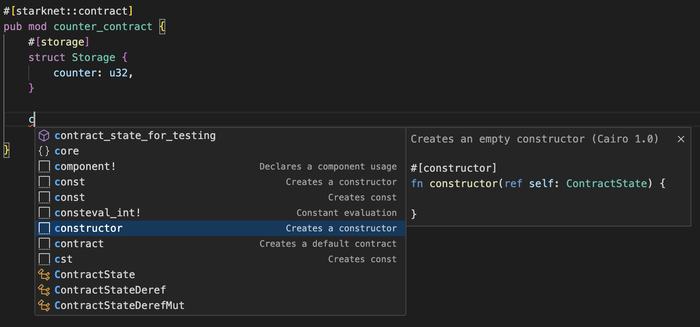
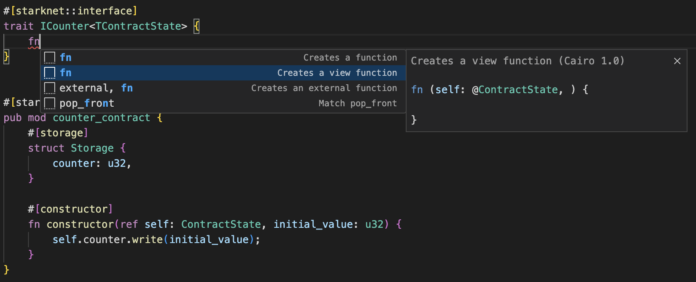
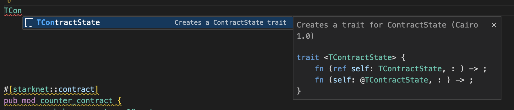

# Content
This file contains information for completing the various steps of the workshop.

This file also contains some useful tips.

# Repository creation on github and preparation on local repository

First create a private github repository called starknet-basecamp-x-counter-workshop.git without REAMME.md and without licence (to keep the starknet-edu counter workshop licence)

````
git clone git@github.com:gsbujo/starknet-basecamp-x-counter-workshop.git
cd starknet-basecamp-x-counter-workshop
git remote add workshop https://github.com/starknet-edu/counter-workshop.git
git fetch workshop\
git checkout -b master workshop/master
git checkout -b step1 workshop/step1
git checkout -b step2 workshop/step2
git checkout -b step3 workshop/step3
git checkout -b step4 workshop/step4
git checkout -b step5 workshop/step5
git checkout -b step6 workshop/step6
git checkout -b step7 workshop/step7
git checkout -b step8 workshop/step8
git checkout -b step9 workshop/step9
git checkout -b step10 workshop/step10
git checkout -b step11 workshop/step11
git checkout -b step12 workshop/step12
git checkout -b step13 workshop/step13
git checkout -b step14 workshop/step14
git checkout -b step15-js workshop/step15-js
git checkout step1
````

# Iterate the following process for each step

Do the step 1 and change the .gitignore to be able to save the work.

The .gitignore file must be like this:
````
node_modules

target

.env
.snfoundry_cache
.DS_Store
````

Save the step1 work into github

````
git add .
git commit -m "Step1 completed"
git push origin step1
````

Once step 1 is pushed, keep all modified files open in VSCode (lib.cairo, counter.cairo, .gitignore, Scarb.toml and homework.MD).

Do :
````
git checkout step2
````

Save all the files opened in VSCode and do the step2.

Iterate the process for the next steps.


## Step 1
From the terminal, initialize the project with `scarb`, naming the package `workshop`.
```
scarb init --name workshop
```
It creates Scarb.toml and src/lib.cairo
The initial Scarb.toml content is :
```
[package]
name = "workshop"
version = "0.1.0"
edition = "2024_07"

# See more keys and their definitions at https://docs.swmansion.com/scarb/docs/reference/manifest.html

[dependencies]

[dev-dependencies]
cairo_test = "2.8.0"
```

`scarb build` creates the target folder.
````
target
├── CACHEDIR.TAG
└── dev
    ├── workshop.starknet_artifacts.json
    └── workshop_counter_contract.contract_class.json
````

`scarb clean` deletes the target folder.


## Step 2
### Note :
Without test script defined Scarb.toml, the output of scarb test is 
````
scarb test
     Running cairo-test workshop
   Compiling test(workshop_unittest) workshop v0.1.0 (/Users/gsbujo/projects/starknet/basecampx/starknet-basecamp-x-counter-workshop/Scarb.toml)
   Compiling test(workshop_tests) workshop_tests v0.1.0 (/Users/gsbujo/projects/starknet/basecampx/starknet-basecamp-x-counter-workshop/Scarb.toml)
    Finished release target(s) in 5 seconds
testing workshop ...
running 1 test
test workshop_tests::test_step::test_snforge ... ok (gas usage est.: 22440)
test result: ok. 1 passed; 0 failed; 0 ignored; 0 filtered out;

running 0 tests
test result: ok. 0 passed; 0 failed; 0 ignored; 0 filtered out;
````

With test script defined Scarb.toml, the output of scarb test is now that we need
````
scarb test
     Running test workshop (snforge test)
   Compiling workshop v0.1.0 (/Users/gsbujo/projects/starknet/basecampx/starknet-basecamp-x-counter-workshop/Scarb.toml)
    Finished release target(s) in 2 seconds


Collected 1 test(s) from workshop package
Running 0 test(s) from src/
Running 1 test(s) from tests/
[PASS] tests::test_step::test_snforge (gas: ~1)
Tests: 1 passed, 0 failed, 0 skipped, 0 ignored, 0 filtered out
````

#### without casm=true
```
gsbujo@macbook-air starknet-basecamp-x-counter-workshop % scarb build
   Compiling workshop v0.1.0 (/Users/gsbujo/projects/starknet/basecampx/starknet-basecamp-x-counter-workshop/Scarb.toml)
    Finished release target(s) in 2 seconds
gsbujo@macbook-air starknet-basecamp-x-counter-workshop % tree target
target
├── CACHEDIR.TAG
└── dev
    ├── workshop.starknet_artifacts.json
    └── workshop_counter_contract.contract_class.json

2 directories, 3 files
```

#### with casm=true
This is necessary when we want to deploy the script (step 15)

```
gsbujo@macbook-air starknet-basecamp-x-counter-workshop % scarb build
   Compiling workshop v0.1.0 (/Users/gsbujo/projects/starknet/basecampx/starknet-basecamp-x-counter-workshop/Scarb.toml)
    Finished release target(s) in 2 seconds
gsbujo@macbook-air starknet-basecamp-x-counter-workshop % tree target
target
├── CACHEDIR.TAG
└── dev
    ├── workshop.starknet_artifacts.json
    ├── workshop_counter_contract.compiled_contract_class.json
    └── workshop_counter_contract.contract_class.json

2 directories, 4 files
```

Finally with scarb test
```
gsbujo@macbook-air starknet-basecamp-x-counter-workshop % scarb test 
     Running test workshop (snforge test)
   Compiling workshop v0.1.0 (/Users/gsbujo/projects/starknet/basecampx/starknet-basecamp-x-counter-workshop/Scarb.toml)
    Finished release target(s) in 2 seconds


Collected 1 test(s) from workshop package
Running 0 test(s) from src/
Running 1 test(s) from tests/
[PASS] tests::test_step::test_snforge (gas: ~1)
Tests: 1 passed, 0 failed, 0 skipped, 0 ignored, 0 filtered out
gsbujo@macbook-air starknet-basecamp-x-counter-workshop % tree target
target
├── CACHEDIR.TAG
└── dev
    ├── snforge
    │   └── workshop.snforge_sierra.json
    ├── workshop.starknet_artifacts.json
    ├── workshop_counter_contract.compiled_contract_class.json
    └── workshop_counter_contract.contract_class.json

3 directories, 5 files
```


### Note on the prelude to be used
https://book.cairo-lang.org/appendix-04-cairo-prelude.html#prelude

The cairo prelude is a collection of commonly used modules, function, data types ans traits that are automatically brought into scope of every module in a Cairo crate without needing explicit import statements.
In the edition "2023_01", all was included. 
In the edition "2024_07", not all is include (in this way it's possible to fine tuning what is included).

## Step 3

The "Cairo 1.0" extension (Cairo for Visual Studio Code extension) provide a code completion.

Start typing constructor will popup the contextual menu. Choose constructor and press enter will paste the constructor template.



````
    #[constructor]
    fn constructor(ref self: ContractState, initial_value: u32) {
        self.counter.write(initial_value);       
    }
````


## Step 4

Create a view function:



or Create a trait 




The interface:
````
#[starknet::interface]
pub trait ICounter<TContractState> {
    fn get_counter(self: @TContractState) -> u32;
}
````

The implementation of the code logic goes inside the contract.
It can be coded in 2 various correct ways:
### version 1 with the use of super::
````
#[starknet::contract]
pub mod counter_contract {
    #[storage]
    struct Storage {
        counter: u32,
    }

    #[constructor]
    fn constructor(ref self: ContractState, initial_value: u32) {
        self.counter.write(initial_value);       
    }

    #[abi(embed_v0)]
    impl CounterImpl of super::ICounter<ContractState>{
        fn get_counter(self: @ContractState) -> u32 {
            self.counter.read()
        }
    }
}
````

### version 2 with the use of mod

````
#[starknet::contract]
pub mod counter_contract {
    use workshop::counter::ICounter;

    #[storage]
    struct Storage {
        counter: u32,
    }

    #[constructor]
    fn constructor(ref self: ContractState, initial_value: u32) {
        self.counter.write(initial_value);       
    }

    #[abi(embed_v0)]
    impl CounterImpl of ICounter<ContractState>{
        fn get_counter(self: @ContractState) -> u32 {
            self.counter.read()
        }
    }
}
````

Note : #[abi(embed_v0)] is used to exposed the implementation block.

## Step 5


Implementation part can be
````
        fn increase_counter(ref self: ContractState) {
            self.counter.write(self.counter.read() + 1);
        }

````
or simplier :

````
        fn increase_counter(ref self: ContractState) {
            self.counter.write(self.get_counter() + 1);
        }

````


## Step 6

Create the contract's event set by starting to type 'event'
````
    #[event]
    #[derive(Drop, starknet::Event)]
    enum Event {
        CounterIncreased: CounterIncreased,
    }
````

Create an event by starting to type 'event'
````
    #[derive(Drop, starknet::Event)]
    struct CounterIncreased {
        value: u32,
    }
````

Emit the event:
````
        fn increase_counter(ref self: ContractState) {
            self.counter.write(self.get_counter() + 1);
            self.emit(CounterIncreased {value: self.get_counter()});
        }
````

It can be write in this way :
````
        fn increase_counter(ref self: ContractState) {
            self.counter.write(self.get_counter() + 1);
            let value = self.get_counter();
            self.emit(CounterIncreased {value});
        }
````

## Step 7

Deplare the kill_switch package as a dependency and allow its compilation. 

````
[dependencies]
kill_switch = { git = "https://github.com/starknet-edu/kill-switch", branch = "master" }

[[target.starknet-contract]]
build-external-contracts = ["kill_switch::KillSwitch"]
````

## Step 8

````
pub mod counter_contract {
    use starknet::event::EventEmitter;
    use workshop::counter::ICounter;
    use starknet::ContractAddress;

    #[storage]
    struct Storage {
        counter: u32,
        kill_switch: ContractAddress,
    }

    #[constructor]
    fn constructor(ref self: ContractState, initial_value: u32, kill_switch: ContractAddress) {
        self.counter.write(initial_value);
        self.kill_switch.write(kill_switch);
    }

    ...
}
````

## Step 9

The compiler would automatically generate the dispatcher struct and the dispatcher trait for a given interface.

Import the Dispatcher and DispatcherTrait of the KillSwitch contract with :

````
    use kill_switch::{IKillSwitchDispatcher, IKillSwitchDispatcherTrait};
````

Use the dispatcher with :
````
let kill_switch_dispatcher = IKillSwitchDispatcher { contract_address: self.kill_switch.read() };
````

## Step 10

Note : We want allow to increase the counter if is_active() of KillSwitch returns false.
````
            let kill_switch_dispatcher = IKillSwitchDispatcher { contract_address: self.kill_switch.read() };
            // Protect the increase_counter() function by reverting the transaction if KillSwitch mechanism is enabled.
            assert!(!kill_switch_dispatcher.is_active(), "Kill Switch is active");
````

## Step 11

Just add the following in the Scarb.toml

````
[dependencies]
openzeppelin = { git = "https://github.com/OpenZeppelin/cairo-contracts.git", tag = "v0.16.0" }
````

## Step 12

See https://docs.openzeppelin.com/contracts-cairo/0.11.0/access

Note : It can be very usefull to use the auto-completion. 
Type "use o" to find "use openzeppelin", then type "::" to find "use::openzeppelin::access" and so on.

````
    use openzeppelin::access::ownable::OwnableComponent;
    component!(path: OwnableComponent, storage: ownable, event: OwnableEvent);

````

Add the Storage part

````
        #[substorage(v0)]
        ownable: OwnableComponent::Storage
````


Add the Event part 

````
        #[flat]
        OwnableEvent: OwnableComponent::Event
````

Embed the component's logic into our contract

````
    #[abi(embed_v0)]
    impl OwnableImpl = OwnableComponent::OwnableImpl<ContractState>;
````

## Step 13

Update the constructor with initial_owner
````
    #[constructor]
    fn constructor(ref self: ContractState, initial_value: u32, kill_switch: ContractAddress, initial_owner: ContractAddress) {
        self.counter.write(initial_value);
        self.kill_switch.write(kill_switch);
        self.ownable.initializer(initial_owner);
    }
````
